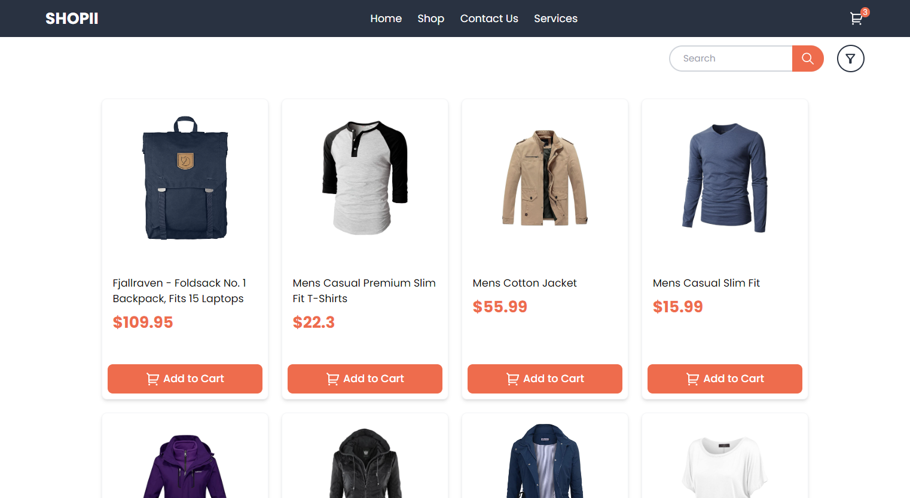
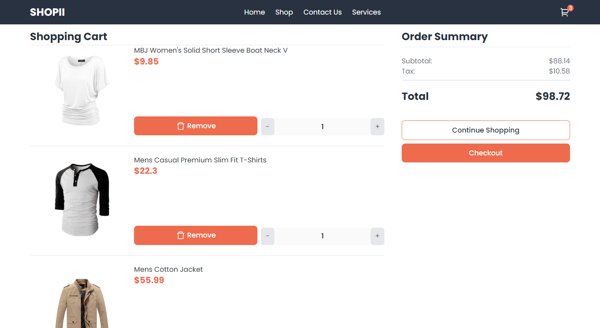

# Shopii a Fake-Store

A simple responsive e-commerce as a personal project for The OdinProject. You may try it live [here](https://dwarjie.github.io/fake-store/)

### Screenshots






### Installation

```bash
git clone https://github.com/dwarjie/fake-store
cd fake-store
npm install
npm run dev
```

### Tools/Language

- ReactJS
- Tailwind CSS
- react-router-dom
- fake-api (for fake data)
- prop-types (for prop-types checking)
- vitest (for unit testing)
- react-testing-library (for ui testing)
- react-hot-toast (for toast pop-ups)

### TODO

- [x] Initial Setup
- [x] Deployment to Github Pages
- [x] Create Landing Page
- [x] Style Side Nav in Mobile
- [x] Fetch data using API from fake-store
- [x] Create Shop Page
- [x] Filter by Category
- [x] Search products by name
- [x] Add to Cart Functionality
- [x] Show something when product is added to cart
- [ ] Add some animations?
